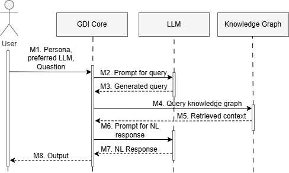

# GraphRAG Dialogue Insights (GDI)
This repository contains the source code of GraphRAG Dialogue Insights (GDI). 

Issue Tracking Systems are a valuable and ever-evolving source of knowledge, as team members can read, update, expand, and act on the captured information. We use the term work items to refer to any trackable unit of work in the software development process, including epics, features, user stories, bugs, and tasks. Detailed work items that are adequately linked to one another are helpful in supporting software development teams. However, as systems and projects increase in complexity, navigating work items using traditional ITSs becomes challenging and time-consuming, as these systems have limited functionality for searching and acquiring knowledge, making it difficult to answer complex questions required for tasks. 

We introduce GDI, which enables users to query work items from issue-tracking systems (represented as a knowledge graph) using natural language. In addition to a natural language response, GDI returns supporting information to help users understand how the LLM queries the knowledge graph. 

Since GDI is based on GraphRAG, an LLM and a knowledge graph are essential components of a GDI instance, together with the GDI Core component that
facilitates interaction among the components in GDI (see the sequence diagram below). 




The user selects a stakeholder-based persona prompt and the preferred LLM from the dropdown buttons in the left sidebar of GDI.
- (M1) The user initiates the interaction by asking a question to GDI.
- (M2) The GDI Core component constructs a prompt using [the prompt template](src/prompts/cypher_prompt.py) that includes the graph schema and the user’s question and sends it to LLM.
- (M3) Based on this prompt, the LLM generates a query in the query language used for the knowledge graph. 
- (M4) The GDI Core component queries the knowledge graph with this query.
- (M5) The knowledge graph sends the structured data corresponding to the query as the retrieved context.
- (M6) GDI Core constructs a [prompt](src/prompts/stakeholder_prompt.py) using this context, the persona selected by the user, and a question, and sends it to the LLM.
- (M7) GDI Core receives the NL response.
- (M8) Finally, the output is presented to the user.

The output consists of a) a natural language response to the question, b) the generated query used to query the knowledge graph, and c) the retrieved context as a result of the query. 

You can use this repository to:
1. Interact with GDI to determine its suitability for your context.
2. Use your own knowledge graph and query work items using GDI.
3. Reproduce the results presented in the <a href="#6-related-publication">Related Publication</a> section by following the steps outlined in the <a href="#5-steps-to-reproduce">Steps to Reproduce</a> section.

<br>

> [!NOTE]  
We provide the open-source knowledge graph. Due to confidentiality agreements, we cannot share the proprietary knowledge graph used in our study. To use GDI with your data, you have to create a knowledge graph.  <a href="#6-related-publication">Our paper </a> offers an overview of the knowledge graph construction process. For more instructions, refer to Fensel, D. et al. (2020). How to Build a Knowledge Graph. In: Knowledge Graphs. Springer, Cham. https://doi.org/10.1007/978-3-030-37439-6_2 .

# Table of Contents
<details>
  <summary>Table of Contents (click to expand) </summary>
  <ol>
    <li><a href="#1-repository-structure">Repository Structure</a></li>
    <li><a href="#2-system-requirements">System Requirements</a></li>
    <li><a href="#3-installation-instructions">Installation Instructions</a></li>
    <li><a href="#4-usage-instructions">Usage Instructions</a></li>
    <li><a href="#5-steps-to-reproduce">Steps to Reproduce</a></li>
    <li><a href="#6-related-publication">Related Publication</a></li>
    <li><a href="#7-authors-information">Authors Information</a></li>
    <li><a href="#8-suggested-citation">Suggested Citation</a></li>
  </ol>
</details>
<br>

# 1. Repository Structure 
In this section, we first present <a href="#graphical-overview">a graphical overview</a> of the repository’s folder structure and files. Subsequently, we provide an explanation of <a href="#description-of-folders-and-files">each folder and file</a>. 

## Graphical Overview
```
GDI/
┣━ src
┃   ┣━ knowledge-graph
┃   ┃  ┣━ improved_version_knowledge_graph.txt
┃   ┃  ┗━ original_version_knowledge_graph.txt
┃   ┣━ prompts
┃   ┃   ┣━ cypher_prompt.py
┃   ┃   ┗━ stakeholder_prompt.py
┃   ┣━  GDI.py
┃   ┣━  process_logs.py
┃   ┗━  requirements.txt
┣━ supplementary-materials
┃   ┣━ saved_logs
┃   ┃    ┗━ graphrag_dialogue_insights_{timestamp}.json
┃   ┣━ onboarding
┃   ┃  ┣━ software_engineer
┃   ┃  ┃  ┣━ extracted questions
┃   ┃  ┃  ┃  ┣━ P1_extracted_questions.json
┃   ┃  ┃  ┃  ┣━ P2_extracted_questions.json
┃   ┃  ┃  ┃  ┣━ P3_extracted_questions.json
┃   ┃  ┃  ┃  ┣━ P4_extracted_questions.json
┃   ┃  ┃  ┃  ┣━ P5_extracted_questions.json
┃   ┃  ┃  ┣━ P1_graphrag_dialogue_insights.json
┃   ┃  ┃  ┣━ P2_graphrag_dialogue_insights.json
┃   ┃  ┃  ┣━ P3_graphrag_dialogue_insights.json
┃   ┃  ┃  ┣━ P4_graphrag_dialogue_insights.json
┃   ┃  ┃  ┗━ P5_graphrag_dialogue_insights.json
┃   ┃  ┗━ software_engineer_few_shot
┃   ┃     ┣━ P1_graphrag_dialogue_insights.json
┃   ┃     ┣━ P2_graphrag_dialogue_insights.json
┃   ┃     ┣━ P3_graphrag_dialogue_insights.json
┃   ┃     ┣━ P4_graphrag_dialogue_insights.json
┃   ┃     ┗━  P5_graphrag_dialogue_insights.json
┃   ┣━ trace-link-recovery
┃   ┃  ┣━ Informed-consent.docx
┃   ┃  ┗━ Protocol.docx
┃   ┣━ Questions.docx
┃   ┗━ sequence-diagram.png
┣━ .gitignore
┣━ CITATION.cff
┣━ LICENSE
┗━ README.md
```

## Description of Folders and Files
<details>
<summary> Description of Folders and Files (click to expand) </summary>

<br>


| **Folder/file** | **Description** |
|---------------|-----------------|
| [GDI/](/)| The root folder of GDI, including the source code and supplementary materials.|
| [GDI/src/](src/)| The folder contains the core source code of the GDI project. | 
| [GDI/src/knowledge-graph](src/knowledge-graph)| The folder contains the Cypher scripts used to build the knowledge graphs in [Neo4j](https://neo4j.com/). |
| [GDI/src/knowledge-graph/improved_version_knowledge_graph.txt](src/knowledge-graph/improved_version_knowledge_graph.txt)| Cypher script for the improved knowledge graph, based on participant feedback.  |
| [GDI/src/knowledge-graph/original_version_knowledge_graph.txt](src/knowledge-graph/original_version_knowledge_graph.txt)| Cypher script for the original version of the knowledge graph. |
| [GDI/src/prompts](src/prompts)| The folder contains prompt templates for generating prompts.|
| [GDI/src/prompts/cypher_prompt.py](src/prompts/cypher_prompt.py)| Prompt template for generating Cypher statements. |
| [GDI/src/prompts/stakeholder_prompt.py](src/prompts/stakeholder_prompt.py)| Prompt template for generating natural language answers. |
| [GDI/src/GDI.py](src/GDI.py)| The file contains the source code of GDI, including the GDI Core that facilitates interaction among the selected LLM and the knowledge graph in [Neo4j](https://neo4j.com/).| 
| [GDI/src/process_logs.py](src/process_logs.py)| The file contains the source for extracting unique questions from the participants' logs. | 
| [GDI/src/requirements.txt](src/requirements.txt)| The file contains a list of packages or libraries required to execute the source code files. | 
| [GDI/supplementary-materials](supplementary-materials)| The folder contains the non-executable materials that have been used in the research of <a href="#related-publication">the related publication</a>. |
| [GDI/supplementary-materials/saved-logs](supplementary-materials/saved-logs)| The folder contains the saved log files of the session. |
| [GDI/supplementary-materials/saved-logs/graphrag_dialogue_insights_[timestamp]_.json](supplementary-materials/saved-logs/graphrag_dialogue_insights_[timestamp]_.json)| The folder contains the saved log files of the session. |
| [GDI/supplementary-materials/onboarding](supplementary-materials/onboarding)| The folder contains the supplementary materials for the onboarding use case. |
| [GDI/supplementary-materials/onboarding/software_engineer](supplementary-materials/onboarding/software_engineer)| The folder contains the log files from the user-centered validation sessions. |
| [GDI/supplementary-materials/onboarding/software_engineer/extracted_questions](supplementary-materials/onboarding/software_engineer/extracted_questions)| The folder contains extracted questions from the log files of the user-centered validation sessions. |
| [GDI/supplementary-materials/onboarding/software_engineer/extracted_questions/P[Number]_graphrag_dialogue_insights.json](supplementary-materials/onboarding/software_engineer/extracted_questions/P[Number]_graphrag_dialogue_insights.json)| The extracted user questions from the log files of participants P1-P5 of the user-centered validation sessions. |
| [GDI/supplementary-materials/onboarding/software_engineer/P[Number]_graphrag_dialogue_insights.json](supplementary-materials/onboarding/software_engineer/P[Number]_graphrag_dialogue_insights.json)| The log files of participants P1-P5 of the user-centered validation sessions. |
| [GDI/supplementary-materials/onboarding/software_engineer/P[Number]_few_shot_graphrag_dialogue_insights.json](supplementary-materials/onboarding/software_engineer/P[Number]_few_shot_graphrag_dialogue_insights.json)| The log files of participants P1-P5 of the user-centered validation sessions, when we rerun the user questions after applying few-shot prompting. |
| [GDI/supplementary-materials/trace-link-recovery](supplementary-materials/trace-link-recovery)| The folder contains the supplementary materials for the trace link recovery use case. |
| [GDI/supplementary-materials/trace-link-recovery/Informed-consent.docx](supplementary-materials/trace-link-recovery/Informed-consent.docx)| Informed consent form for the user-centered validation sessions. |
| [GDI/supplementary-materials/trace-link-recovery/Protocol.docx](supplementary-materials/trace-link-recovery/Protocol.docx)| Protocol to conduct the user-centered validation session. |
| [GDI/supplementary-materials/Questions.docx](supplementary-materials/Questions.docx)| The file contains questions regarding the validation of GDI, which are used in the survey (onboarding use case) and the interviews (trace link recovery use case). |
| [GDI/supplementary-materials/sequence-diagram.png](supplementary-materials/sequence-diagram.png)| The sequence diagram presents the interactions between GDI Core, LLM, and the knowledge graph. |

</details>

<p align="right">(<a href="#top">↑ Back to Top</a>)</p>

<br>


# 2. System Requirements 
The following requirements must be met in order to use the artifacts in this repository:
- To run the source code, [Python 3.9](https://www.python.org/downloads/release/python-390/) has to be installed, and an Integrated Development 
Environment (IDE) such as [Visual Studio Code](https://code.visualstudio.com/download) is recommended. 
  - [Optional] To clone the repository, you have to install [Git](https://git-scm.com/downloads).
  - [Optional] To use the Docker setup, [Docker Desktop](https://www.docker.com/products/docker-desktop/) is required.
  - [Optional] To use OpenAI's GPT-4, [an OpenAI API key](https://help.openai.com/en/articles/4936850-where-do-i-find-my-secret-api-key) is needed.
- To open and edit the supplementary material, specifically .docx files, [Microsoft Word](https://www.microsoft.com/nl-nl/microsoft-365/word?market=nl) is required.

The technologies used in this repository, such as Streamlit, Neo4j, and Cypher, are modular and can be interchanged.

All the required packages and libraries can be automatically installed when running the following command: `pip install -r src/requirements.txt`.

> [!NOTE]  
We have tested GDI on two devices: 1) a Mac M1 Pro with 32GB unified memory (200GB/s bandwidth), a 14-core GPU, and a 16-core Neural Engine, and 2) a desktop with Intel Core i7 CPU, Nvidia GeForce RTX 4080 Super (16VRAM), and DDR5 16GB Memory. If you are running GDI on a device with lower specifications, it may take several minutes before you receive a response.

<p align="right">(<a href="#top">↑ Back to Top</a>)</p>

# 3. Installation Instructions
There are two ways to run GDI:
1) Via a Docker setup (this is the faster option).
2) Through a local installation.

## 1. Docker setup 

### A. Setting up Neo4j
1. Open Docker Desktop, and on the bottom-right, click on >_ Terminal button, and run the following command to start a Neo4j instance:
```
docker run --name neo4j-apoc --publish=7474:7474 --publish=7687:7687 --env='NEO4J_PLUGINS=[\"apoc\"]' --env=NEO4J_AUTH=neo4j/password neo4j:latest
```

2. Open http://localhost:7474/ in your browser and use the credentials below to log in to Neo4j:
  ```
  Username: neo4j
  Password: password (for your own instance, please use a secure password)
  ```
3. Copy the script of [the original](src/knowledge-graph/original_version_knowledge_graph.txt), or [the improved version](src/knowledge-graph/improved_version_knowledge_graph.txt) of the knowledge graph, and paste it into the query window in Neo4j and run it. A success message _(e.g., "Creates X nodes, created X relationships, set X properties, added X labels")_ confirms that the knowledge graph has been created.

### B. Setting up Ollama
1. For CPU only, run the following command to set up ollama: `docker run -d -v ollama:/root/.ollama -p 11434:11434 --name ollama ollama/ollama`
- To start a CPU-only Docker container, run the following command: `ollama run llama3.1`

2. For GPU Support, additional steps are required, which can be followed in [Ollama GPU Docker Guide](https://hub.docker.com/r/ollama/ollama). For a more detailed guide, please follow the steps in the [detailed guide to configure GPU support.](https://medium.com/@researchgraph/how-to-run-ollama-on-windows-8a1622525ada)

## 2. Local setup
###  A. Setting up Neo4j 
1. Install [Neo4j desktop](https://neo4j.com/download/).
2. Click on the button _Create instance_, fill in the following details, and click on the _Create_ button:
```
Instance name: select an instance name representing the knowledge graph (e.g., Microservices Example)
Neo4j version: select the newest version (e.g., 2025.05.0)
Username: neo4j
Password: password (for your own instance, please use a secure password)
```
3. On the right side bar, click on _Local instances_, and navigate to the created instance. Click on the three dots at the top right of the instance. A drop-down menu appears, then click on the _Plugins_ option. 
4. Search for the _APOC_ plugin and click the _Install_ button.
5. Find the _neo4j.conf_ by copying the _path_ button in Neo4j, and click on the _conf_ folder. Click on the _neo4j.conf_ and add the following line `dbms.security.procedures.unrestricted=apoc.*` under `dbms.security.procedures.allowlist=apoc.*`.
6. Restart the instance to finish the plugin installation by clicking on the _restart_ button.
7. Copy the script of [the original](src/knowledge-graph/original_version_knowledge_graph.txt), or [the improved version](src/knowledge-graph/improved_version_knowledge_graph.txt) of the knowledge graph, and paste it into the query window in Neo4j and run it. A success message _(e.g., "Creates X nodes, created X relationships, set X properties, added X labels")_ confirms that the knowledge graph has been created.


### B. Setting up Ollama
1. Install [Ollama](https://ollama.com/).
2. Install and run Llama3.1 by running the following command: `ollama run llama3.1`

## 3. Running GDI
To run GDI, please follow the steps below:
1. Download the repository by clicking on the _<> Code_ button, and clicking on _Download ZIP_, or clone the repository via your preferred method. We suggest using the git command: `git clone https://github.com/DelinaLy/GDI.git`
2. Open the repository in your preferred  IDE.
3. To avoid conflicts with your local Python environment, we suggest creating a [virtual environment](https://docs.python.org/3/library/venv.html).
  - 3.1 Install virtualenv: `pip install virtualenv`
  - 3.2 Create a virtual environment: `python -m venv env`
  - 3.3 Activate the virtual environment:
  ```
  For Windows: env/Scripts/activate.bat (commandline) or env/Scripts/Activate.ps1 (powershell)
  For MAC/Linux: source env/bin/activate 
  ```
  - 3.4 Navigate to the src folder and install the requirements: `pip install -r requirements.txt`
4. To start GDI, run the following command in the src folder: `streamlit run GDI.py`
You can open GDI in your browser by navigating to http://localhost:8501.

<p align="right">(<a href="#top">↑ Back to Top</a>)</p>

# 4. Usage Instructions
Please follow the <a href="#3-installation-instructions">installation instructions</a> to run GDI. 

We have provided a description of GDI's user interface in Section III in <a href="#6-related-publication">our paper</a>. A Cheat Sheet with example user questions, such as _"I want to fix a bug in [REPLACE WITH SERVICE NAME]. What are its dependencies?"_, along with guidelines (collapsable) are provided in the GDI's browser interface.  The user can explore the knowledge graph by running `MATCH (n)-[r]->(m) RETURN n, r, m` in the query window of Neo4j. This will provide an overview of the knowledge graph. 

1. The user selects a stakeholder-based persona prompt and the preferred LLM from the dropdown buttons in the left sidebar of GDI.
2. The user can type the question in the _input field_ and click on the _Send_ button to receive a response. The response consists of a) a natural language response, b) a corresponding Neo4j Query (which can be copied and run into Neo4j), and c) the retrieved context (which can be copied, collapsed, and expanded).
4. Based on the answer given by GDI, the user can ask other questions by repeating steps 2 and 3.
5. The user can save the chat history by clicking on the _Save Session_ button. The saved files can be found in the folder [GDI/supplementary-materials/saved-logs](supplementary-materials/saved-logs).

The video below provides a visual representation of steps 1 and 2:

https://github.com/user-attachments/assets/9eee107f-a8e9-470d-8899-1e52b4d1d6a1

For the onboarding use case, we conducted a group cognitive walkthrough with participants to systematically validate GDI by reasoning through user actions and identifying potential usability issues. The steps and protocol for this session are described in Section IV in <a href="#6-related-publication">our paper</a>. 

For the trace link recovery, we have provided the following materials:
- [The informed consent form](supplementary-materials/trace-link-recovery/Informed-consent.docx), which other researchers can use to obtain informed consent from participants for user-centered validation sessions.
- [The protocol for user-centered validation sessions](supplementary-materials/trace-link-recovery/Protocol.docx), enabling researchers to replicate user-centered validation sessions.

For both use cases, we used [the same set of validation questions](supplementary-materials/Questions.docx) in the survey (onboarding use case) and the interviews (trace link recovery use case).

<p align="right">(<a href="#top">↑ Back to Top</a>)</p>


# 5. Steps to Reproduce 
In this section, we describe how to reproduce the results from the individual user-centered validation sessions of the onboarding use case.
1. In the [GDI/supplementary-materials/onboarding/software_engineer/](/supplementary-materials/onboarding/software_engineer/) folder, we have provided the logs of the participants P1-P5 from the user-centered validation sessions. To extract the unique questions from these logs, run `python process.logs.py` in the src folder. A file is generated for each participant in the [/supplementary-materials/onboarding/software_engineer/extracted_questions](/supplementary-materials/onboarding/software_engineer/extracted_questions). 
2. In [GDI/src/GDI.py](/src/GDI.py), we have provided comments on lines 79-88 and 94-95 to provide guidance to loop through the user questions and reproduce the results. Note that since we are using a large language model, the answer can vary slightly from the reproduced results.
3. Follow the <a href="#3-installation-instructions">installation instructions.</a> 
4. Click on the _Send_ button. The user questions are automatically asked to GDI. Depending on your desktop, this can take a few minutes.
5. You can save the log by clicking on the _Save Session_ button. The saved files can be found in the folder [GDI/supplementary-materials/saved-logs](supplementary-materials/saved-logs).

<p align="right">(<a href="#top">↑ Back to Top</a>)</p>

# 6. Related Publication
GDI is introduced in our paper, "_Navigating through Work Items in Issue Tracking Systems via Natural Language Queries_," which has been accepted for presentation in 
[the Industrial Innovation Track](https://conf.researchr.org/track/RE-2025/RE-2025-industrial-innovation-papers) at the Requirements Engineering Conference.

>Ly, D., Radhakrishnan, S., Aydemir, F. B., & Dalpiaz, F. (2025). "Navigating through Work Items in Issue Tracking Systems via Natural Language Queries," 2025 33rd IEEE International Requirements Engineering Conference (RE), Valencia, Spain, 2025

<p align="right">(<a href="#top">↑ Back to Top</a>)</p>

# 7. Authors Information
The artifact was created by the following authors:
| Name | Affiliation | ORCID | Contact |
|---|---|---|---|
| [Delina Ly (corresponding author)](https://www.linkedin.com/in/delina-ly/) | VX Company, Utrecht University | https://orcid.org/0000-0002-7972-7530 | [dly@vxcompany.com](mailto:dly@vxcompany.com)|
| [Sruthi Radhakrishnan](https://www.linkedin.com/in/sruthi--radhakrishnan/) | itemis, Germany | N/A | [radhakrishnan@itemis.com](mailto:radhakrishnan@itemis.com)|
| [Dr. Fatma Başak Aydemir](https://www.uu.nl/staff/FBAydemir) | Utrecht University, The Netherlands | https://orcid.org/0000-0003-3833-3997| [f.b.aydemir@uu.nl](mailto:f.b.aydemir@uu.nl)| 
| [Prof. Dr. Fabiano Dalpiaz](https://www.uu.nl/medewerkers/FDalpiaz) | Utrecht University, The Netherlands |https://orcid.org/0000-0003-4480-3887| [f.dalpiaz@uu.nl](mailto:f.dalpiaz@uu.nl) | 

<p align="right">(<a href="#top">↑ Back to Top</a>)</p>

# 8. Suggested citation

If you would like to cite this artifact, we suggest using the following citation in your paper:

>[__Ly, D., Radhakrishnan, S., Aydemir, F. B., & Dalpiaz, F. (2025). DelinaLy/GDI: GraphRag Dialogue Insights (v1.1). Zenodo. https://doi.org/10.5281/zenodo.15681739__](https://doi.org/10.5281/zenodo.15681739)

You can cite this repository by clicking on the "_Cite this repository_" button on the top-right menu of this repository to copy the APA and BibTeX versions of the citation.

This repository is licensed under [the GNU GPLv3 License](./LICENSE).

<p align="right">(<a href="#top">↑ Back to Top</a>)</p>
